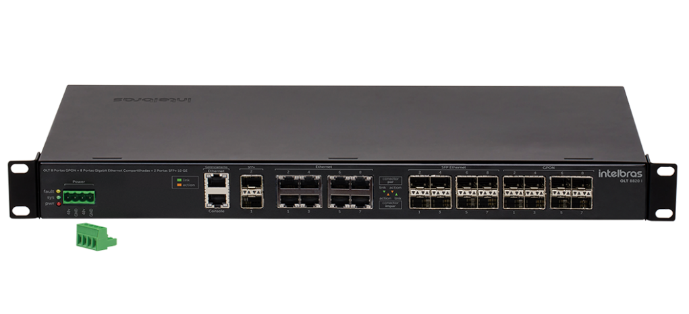

# SC OLT Intelbras 8820i

## OID's

### Monitoramento geral

| Descrição                         | OID                               | Retorno                              |
|-----------------------------------|-----------------------------------|--------------------------------------|
| cpuUsage                          | 1.3.6.1.4.1.2021.11.9.0           | Porcentagem de Uso do CPU            |
| memTotal                          | 1.3.6.1.4.1.2021.4.5.0            | Memória RAM total em KBytes          |
| memFree                           | 1.3.6.1.4.1.2021.4.6.0            | Memória RAM Livre em KBytes          |
| uptime                            | 1.3.6.1.2.1.1.3.0                 | Tempo online do sistema              |
| systemStatusSensor1Temperature    | 1.3.6.1.4.1.26138.1.5.1.1.0       | Temperatura medida do sensor de temperatura 1 em °C |
| systemStatusSensor2Temperature    | 1.3.6.1.4.1.26138.1.5.1.2.0       | Temperatura medida do sensor de temperatura 2 em °C |

### Monitoramento das ONUs

| Descrição                  | OID                                     | Retorno                                                                                                                             |
|----------------------------|-----------------------------------------|-------------------------------------------------------------------------------------------------------------------------------------|
| onuStatusIndex             | .1.3.6.1.4.1.26138.1.2.1.1.1.1          | Existe um ID fixo para as 1024 ONUs... Valor 129 = GPON 2 ONU 1. Valor 257 = GPON 3 ONU 1.                                          |
| onuStatusPort              | .1.3.6.1.4.1.26138.1.2.1.1.1.2          | A porta da OLT na qual a ONU está conectada... Exemplos fornecidos no texto.                                                       |
| onuStatusOnuId             | .1.3.6.1.4.1.26138.1.2.1.1.1.3          | ID da ONU na porta PON                                                                                                              |
| onuStatusRegistered        | .1.3.6.1.4.1.26138.1.2.1.1.1.4          | Status do registro da ONU no sistema. 1 = posição ocupada, 2 = posição livre.                                                       |
| onuStatusActive            | .1.3.6.1.4.1.26138.1.2.1.1.1.5          | Status da ONU. 1 = ONU Ativa, 2 = ONU Inativa.                                                                                      |
| onuStatusSerialNumber      | .1.3.6.1.4.1.26138.1.2.1.1.1.6          | O Serial number da ONU                                                                                                              |
| onuStatusOmciStatus        | 1.3.6.1.4.1.26138.1.2.1.1.1.7           | Status do OMCI da ONU. 2 = ok, 0 = Inativo.                                                                                         |
| onuStatusOltRxPower        | .1.3.6.1.4.1.26138.1.2.1.1.1.8          | Sinal de RX da OLT. Exemplo: -24.80.                                                                                                |
| onuStatusOnuRxPower        | .1.3.6.1.4.1.26138.1.2.1.1.1.9          | Sinal de RX da ONU. Exemplo: -24.80.                                                                                                |
| onuStatusAlarms            | .1.3.6.1.4.1.26138.1.2.1.1.1.10         | String com os alarmes ativos da ONU.                                                                                               |
| onuStatusModel             | .1.3.6.1.4.1.26138.1.2.1.1.1.11         | String com o modelo da ONU                                                                                                          |
| onuStatusVersion           | .1.3.6.1.4.1.26138.1.2.1.1.1.12         | String com a versão de firmware ativa da ONU.                                                                                      |
| onuStatusOnuDescription    | .1.3.6.1.4.1.26138.1.2.1.1.1.13         | Informa a descrição da ONU.                                                                                                        |
| OnuTraps                   | .1.3.6.1.4.1.26138.1.2.2                | Traps das ONUs                                                                                                                     |
| onuDown                    | .1.3.6.1.4.1.26138.1.2.2.1              | Trap que indica que a ONU está down.                                                                                               |
| onuUp                      | .1.3.6.1.4.1.26138.1.2.2.2              | Trap que indica que a ONU está ativa.                                                                                              |
| portStatsActiveOnus        | .1.3.6.1.4.1.26138.1.4.1.1.1.55         | Apresenta a quantidade de CPE’s ativas na interface PON. Exemplo : .1.3.6.1.4.1.26138.1.4.1.1.1.55.9 = GPON 1 e .1.3.6.1.4.1.26138.1.4.1.1.1.55.16 = GPON 8

| portStatsConfiguredOnus    | .1.3.6.1.4.1.26138.1.4.1.1.1.56         | Apresenta a quantidade de CPE’s configuradas na interface PON... Exemplos fornecidos no texto.                                     |

### Monitoramento dos SFPs
